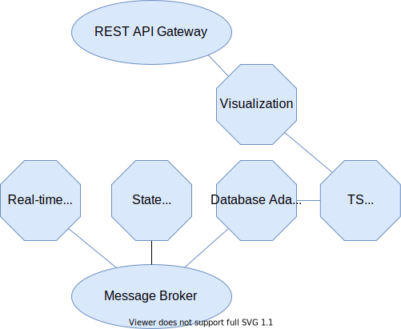

This example demonstrates how to run a state-estimation algorithm that receives measurements from a real-time simulator.
The same setup could be used for real measurement units, which replace the real-time simulator.
The following image shows the software components involved in this example and how they are interconnected.

The services are implemented as follows:
- Message Broker: RabbitMQ
- State-estimation: pyVolt
- Real-time simulation: DPsim
- Database adapter: telegraf
- Time-series database: influx
- Visualization: Grafana
- CIM grid viewer: Pintura

Until a comprehensive guide is available here, please refer to the [notes in the example-deployments repo](https://github.com/sogno-platform/example-deployments/tree/main/pyvolt-dpsim-demo).
